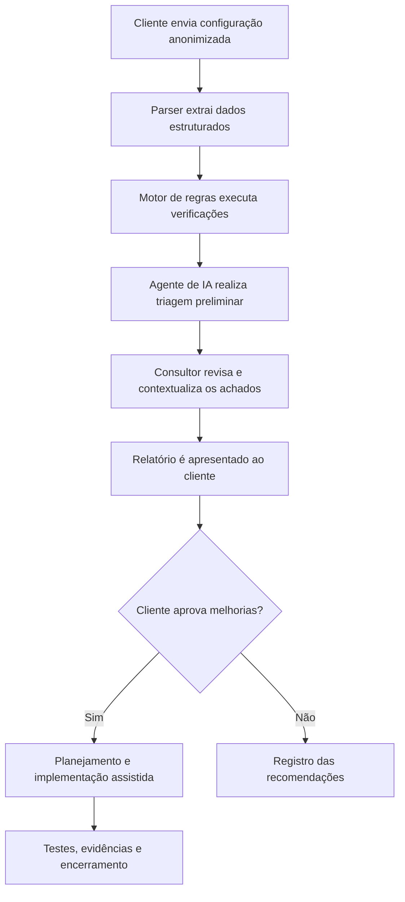

# Documento de Contexto: Netrunner OT

## 1. Introdução

A disponibilidade da rede é essencial para a continuidade de processos corporativos e industriais. Pequenas e médias organizações, no entanto, nem sempre possuem especialistas dedicados para revisar configurações, documentar alterações e acompanhar a evolução dos equipamentos.

A **Netrunner OT** é uma proposta de plataforma web de diagnóstico, conformidade e melhoria contínua de redes. A solução analisará configurações fornecidas pelo cliente, aplicará verificações técnicas e utilizará um agente de inteligência artificial para apoiar a análise preliminar. Os resultados serão revisados por um consultor antes de serem apresentados como recomendações ao cliente.

## 2. Problema identificado

Redes podem permanecer em operação por longos períodos mesmo apresentando condições de risco, como:

- protocolos de gerenciamento inseguros;
- ausência de backups atualizados;
- interfaces e VLANs sem documentação;
- trunks excessivamente permissivos;
- configurações inconsistentes entre dispositivos semelhantes;
- ausência de centralização de logs e sincronismo de horário;
- proteções de camada 2 não configuradas ou aplicadas incorretamente;
- firmware desatualizado;
- alterações sem registro, validação ou plano de retorno;
- dependência do conhecimento de uma única pessoa.

Essas condições podem elevar o tempo de diagnóstico, dificultar auditorias e aumentar o impacto de falhas ou mudanças inadequadas.

## 3. Contexto de aplicação

A proposta atende inicialmente ambientes industriais e organizações com equipes reduzidas de infraestrutura. Nesses ambientes, uma alteração de rede pode afetar sistemas supervisórios, servidores, estações de engenharia, PLCs e a comunicação entre áreas da operação.

A Netrunner OT poderá ser utilizada em:

- avaliações periódicas da saúde da rede;
- preparação para auditorias;
- expansão de plantas e unidades;
- substituição ou atualização de equipamentos;
- preparação de janelas de manutenção;
- investigação de inconsistências;
- documentação e padronização do ambiente;
- acompanhamento de planos de melhoria.

## 4. Público-alvo

- Pequenas e médias indústrias com infraestrutura de TI e OT.
- Integradores de automação e redes industriais.
- Prestadores de serviços e consultorias de infraestrutura.
- Equipes responsáveis por múltiplas unidades ou plantas.
- Empresas sem solução centralizada de inventário, backup e conformidade.

## 5. Solução proposta

A plataforma permitirá que o usuário cadastre um ambiente e envie configurações previamente anonimizadas. Um parser extrairá informações como hostname, modelo, versão, interfaces, VLANs, trunks, SVIs, rotas e serviços de gerenciamento.

Em seguida, um motor de regras determinísticas realizará verificações técnicas. Um agente de IA receberá os dados estruturados e os achados para:

- produzir uma triagem preliminar;
- correlacionar alertas relacionados;
- explicar riscos em linguagem técnica e executiva;
- identificar informações ausentes;
- formular perguntas complementares;
- sugerir prioridades e um plano de ação;
- auxiliar na elaboração de recomendações, testes e rollback.

O agente de IA não deverá aplicar comandos diretamente nos equipamentos. Toda recomendação deverá ser revisada pelo consultor e aprovada pelo cliente antes da implementação.

## 6. Fluxo do serviço

## 7. Entregas ao cliente

- Resumo executivo da situação encontrada.
- Inventário dos dispositivos analisados.
- Pontuação de saúde e segurança.
- Achados classificados por criticidade.
- Evidências relacionadas aos achados.
- Recomendações de melhoria.
- Plano de ação de 30, 60 e 90 dias.
- Configuração corretiva sugerida, quando aplicável.
- Comandos de validação.
- Procedimento de implantação e rollback.
- Relatório de evolução em avaliações posteriores.

## 8. Consultoria associada

A plataforma apoiará um serviço de consultoria. Após o diagnóstico, o consultor poderá:

1. validar os resultados automáticos;
2. eliminar falsos positivos;
3. considerar topologia, criticidade e restrições operacionais;
4. apresentar os riscos ao cliente;
5. elaborar uma proposta de remediação;
6. auxiliar ou acompanhar a implementação;
7. validar o resultado e atualizar a documentação.

A proposta comercial poderá combinar diagnóstico avulso, assinatura recorrente, pacotes de horas técnicas, projetos de correção e suporte em janelas de manutenção.

## 9. Segurança, privacidade e responsabilidade

Configurações de rede podem conter endereços internos, usuários, credenciais, chaves, comunidades SNMP e informações sobre a topologia. A plataforma deverá prever anonimização, controle de acesso, criptografia, segregação por cliente, retenção limitada e exclusão segura.

As recomendações serão apresentadas como apoio técnico. A aplicação dependerá de análise de impacto, backup, janela de manutenção, aprovação do cliente e plano de rollback. A utilização formal do termo responsável técnico deverá observar a habilitação profissional e as exigências aplicáveis ao escopo contratado.

## 10. Modelo de negócio

As fontes de receita previstas são:

- diagnóstico avulso por quantidade e complexidade dos equipamentos;
- assinatura mensal por equipamento ou ambiente;
- acompanhamento periódico e relatórios de evolução;
- pacote de horas de consultoria;
- projeto fechado de remediação;
- suporte em mudanças críticas;
- licenciamento white-label para integradores;
- API e análise em maior escala em versões futuras.

## 11. Lean Canvas

### Problema

- Falta de revisão contínua e padronização das configurações.
- Documentação e backups desatualizados.
- Configurações inseguras ou inconsistentes.
- Alto custo ou complexidade de ferramentas corporativas.
- Dependência de análise manual e profissionais especializados.

### Segmentos de clientes

- Pequenas e médias indústrias.
- Integradores de automação.
- Consultorias e prestadores de serviços de rede.
- Equipes de TI e OT com múltiplos ambientes.

### Proposta de valor única

**Identificar riscos antes que causem indisponibilidade e manter redes industriais seguras, documentadas e padronizadas por meio de automação, IA assistiva e consultoria especializada.**

### Solução

- Upload e interpretação de configurações.
- Auditoria por regras determinísticas.
- Análise preliminar por agente de IA.
- Revisão e acompanhamento por consultor.
- Relatório priorizado com correções, validação e rollback.

### Canais

- Venda consultiva direta.
- Parcerias com integradores de automação.
- Indicações de profissionais de infraestrutura.
- Conteúdo técnico e demonstrações online.
- Projetos-piloto com pequenas e médias empresas.

### Fontes de receita

- Diagnóstico avulso.
- Assinatura por equipamento ou ambiente.
- Consultoria e remediação.
- Suporte durante mudanças.
- White-label e API em etapas futuras.

### Estrutura de custos

- Desenvolvimento e hospedagem da plataforma.
- Processamento do agente de IA.
- Atualização do catálogo e das regras técnicas.
- Armazenamento seguro e geração de relatórios.
- Horas de revisão e consultoria especializada.
- Marketing, suporte e aquisição de clientes.

### Métricas principais

- Quantidade de equipamentos analisados.
- Quantidade de riscos identificados e corrigidos.
- Tempo médio para produzir um diagnóstico.
- Conversão de diagnósticos em projetos de melhoria.
- Clientes recorrentes e receita mensal recorrente.
- Redução de inconsistências entre avaliações.

### Vantagem competitiva

- Foco inicial em redes industriais e switches Cisco Catalyst.
- Combinação de regras auditáveis, agente de IA e revisão humana.
- Capacidade de converter achados em projetos de melhoria acompanhados.
- Base de conhecimento construída a partir de padrões técnicos validados.

## 12. Missão, Visão e Valores

### Missão

Auxiliar organizações na identificação e correção de riscos em redes industriais, combinando automação, inteligência artificial e consultoria especializada para tornar a infraestrutura mais segura, disponível, documentada e padronizada.

### Visão

Tornar a Netrunner OT uma plataforma de referência em diagnóstico e melhoria contínua de redes industriais, oferecendo análises acessíveis e confiáveis para empresas, integradores e profissionais de infraestrutura.

### Valores

- **Segurança:** priorizar a continuidade e a proteção das redes analisadas.
- **Confiabilidade:** utilizar regras verificáveis e revisão humana.
- **Transparência:** explicar achados, riscos, limitações e recomendações.
- **Responsabilidade:** não aplicar alterações críticas sem aprovação.
- **Confidencialidade:** proteger configurações e informações dos clientes.
- **Inovação:** utilizar IA e automação de forma controlada.
- **Padronização:** promover ambientes consistentes e documentados.
- **Melhoria contínua:** acompanhar a evolução da rede e dos processos.
