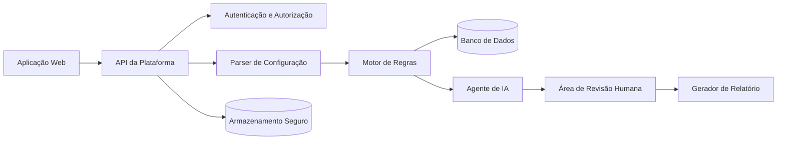

# Especificação do Projeto: Netrunner OT

## 1. Visão geral

A Netrunner OT será uma plataforma web para análise de configurações de equipamentos de rede. O sistema combinará extração estruturada, regras determinísticas, um agente de IA para análise preliminar e revisão humana para produzir relatórios de diagnóstico e recomendações.

## 2. Objetivo geral

Desenvolver um MVP capaz de receber uma configuração de switch, identificar informações relevantes, verificar boas práticas e gerar um relatório preliminar que apoie um serviço de consultoria de redes.

## 3. Objetivos específicos

- Reduzir o tempo necessário para análises iniciais.
- Padronizar relatórios de diagnóstico.
- Identificar riscos de segurança, disponibilidade e operação.
- Manter rastreabilidade entre evidências e recomendações.
- Apoiar o consultor na priorização das melhorias.
- Criar uma base para acompanhamento recorrente do cliente.

## 4. Escopo do MVP

### Incluído

- Cadastro e autenticação local de usuários.
- Cadastro de clientes e ambientes.
- Upload manual de arquivo de configuração em texto.
- Suporte inicial a configurações Cisco IOS e IOS-XE selecionadas.
- Extração de hostname, interfaces, VLANs, trunks, SVIs, rotas e serviços.
- Conjunto inicial de 20 a 30 regras técnicas.
- Classificação dos achados por criticidade.
- Análise preliminar assistida por IA.
- Revisão e edição dos achados pelo consultor.
- Geração de relatório em tela e exportação futura.

### Fora do escopo inicial

- Aplicação automática de comandos.
- Descoberta automática de todos os equipamentos da rede.
- Armazenamento de credenciais de administração dos dispositivos.
- Monitoramento em tempo real.
- Suporte completo a todos os fabricantes e versões.
- Garantia automática de compatibilidade de toda recomendação.

## 5. Perfis de usuário

### Administrador

- Gerenciar usuários e parâmetros da plataforma.
- Manter regras, categorias e versões suportadas.
- Consultar registros de auditoria.

### Consultor

- Cadastrar clientes e ambientes.
- Enviar configurações.
- Revisar achados e recomendações.
- Editar prioridades e observações.
- Finalizar relatórios.

### Cliente

- Visualizar ambientes e relatórios liberados.
- Responder perguntas complementares.
- Registrar aceite ou rejeição de recomendações.

## 6. Requisitos funcionais

- **RF01:** O sistema deve permitir autenticação de usuário.
- **RF02:** O consultor deve poder cadastrar clientes e ambientes.
- **RF03:** O sistema deve aceitar arquivos de configuração em texto.
- **RF04:** O sistema deve alertar sobre possíveis segredos antes do processamento.
- **RF05:** O parser deve extrair os principais elementos da configuração.
- **RF06:** O motor de regras deve criar achados com evidência e criticidade.
- **RF07:** O agente de IA deve receber somente dados autorizados e preferencialmente anonimizados.
- **RF08:** O agente deve gerar triagem, resumo, perguntas e recomendações preliminares.
- **RF09:** O consultor deve poder aprovar, editar ou rejeitar cada achado.
- **RF10:** O sistema deve registrar quem realizou cada revisão.
- **RF11:** O sistema deve gerar um relatório consolidado.
- **RF12:** O sistema deve preservar o histórico das análises.
- **RF13:** O sistema deve permitir comparar duas configurações do mesmo equipamento em uma evolução futura.

## 7. Requisitos não funcionais

- **RNF01:** O sistema deve proteger arquivos em trânsito e em repouso.
- **RNF02:** Os dados de cada cliente devem permanecer segregados.
- **RNF03:** Credenciais e segredos detectados devem ser mascarados.
- **RNF04:** As respostas da IA devem ser identificadas como preliminares.
- **RNF05:** Todo achado deve possuir evidência rastreável.
- **RNF06:** A solução deve registrar operações relevantes em log de auditoria.
- **RNF07:** O sistema deve permitir exclusão de arquivos e resultados conforme a política de retenção.
- **RNF08:** A interface deve ser responsiva e acessível em navegadores atuais.
- **RNF09:** A arquitetura deve permitir inclusão gradual de fabricantes e regras.
- **RNF10:** Falhas no serviço de IA não devem impedir a execução das regras determinísticas.

## 8. Arquitetura preliminar



### Componentes

- **Interface web:** cadastro, upload, acompanhamento e revisão.
- **API:** coordenação das operações e controle de acesso.
- **Parser:** conversão da configuração em dados estruturados.
- **Motor de regras:** verificações previsíveis, testáveis e auditáveis.
- **Agente de IA:** contextualização e elaboração preliminar.
- **Banco de dados:** clientes, ativos, achados, revisões e histórico.
- **Armazenamento:** arquivos protegidos e com política de retenção.
- **Gerador de relatório:** montagem do resultado técnico e executivo.

## 9. Funcionamento do agente de IA

O agente de IA será utilizado como copiloto do consultor. O agente deverá:

1. receber os dados extraídos pelo parser;
2. avaliar os achados produzidos pelo motor de regras;
3. agrupar problemas relacionados;
4. elaborar perguntas quando o contexto for insuficiente;
5. produzir resumo técnico e executivo;
6. sugerir prioridades e próximos passos;
7. propor correções, validações e rollback para revisão.

O agente não deverá:

- acessar equipamentos diretamente no MVP;
- aplicar comandos;
- ocultar a origem dos achados;
- substituir a aprovação humana;
- receber segredos quando a anonimização for possível;
- classificar uma recomendação como garantida sem evidência técnica.

## 10. Regras técnicas iniciais

O conjunto inicial poderá avaliar:

- presença de Telnet ou HTTP sem criptografia;
- configuração de SSH;
- uso de SNMP e versão configurada;
- existência de NTP e syslog;
- presença de AAA;
- portas sem descrição;
- interfaces ociosas ainda habilitadas;
- VLANs e trunks;
- trunks com todas as VLANs permitidas;
- configuração de PortFast e BPDU Guard;
- utilização de UDLD em uplinks compatíveis;
- storm-control;
- inconsistências de EtherChannel;
- ausência de banner e políticas básicas;
- existência de rotas e interfaces de camada 3.

Cada regra deverá possuir identificador, descrição, severidade padrão, condição, evidência, recomendação e referências internas.

## 11. Fluxo principal

1. O consultor cadastra o cliente e o ambiente.
2. O consultor envia uma configuração anonimizada.
3. O sistema procura padrões sensíveis e apresenta alertas.
4. O parser extrai os dados.
5. O motor de regras produz os achados.
6. O agente de IA prepara a análise preliminar.
7. O consultor revisa cada item.
8. O relatório é liberado ao cliente.
9. O cliente pode contratar a implantação das melhorias.
10. Uma nova análise poderá medir a evolução.

## 12. Estrutura mínima de um achado

```json
{
  "id": "NET-SSH-001",
  "titulo": "Acesso Telnet identificado",
  "categoria": "Segurança de gerenciamento",
  "criticidade": "Alta",
  "equipamento": "SW-EXEMPLO-01",
  "evidencia": "line vty 0 4 / transport input telnet",
  "risco": "O tráfego de gerenciamento pode ser transmitido sem criptografia.",
  "recomendacao": "Validar o acesso SSH antes de remover o Telnet.",
  "status_revisao": "Pendente"
}
```

## 13. Dados e segurança

- A configuração deverá ser tratada como informação confidencial.
- O sistema deverá tentar identificar senhas, chaves e communities.
- O cliente deverá autorizar o processamento e definir a retenção.
- O acesso deverá seguir o princípio do menor privilégio.
- Arquivos de clientes não deverão ser usados para treinamento sem autorização expressa.
- O relatório deverá exibir limitações da análise.

## 14. Critérios de sucesso do MVP

- Extrair corretamente os elementos essenciais de configurações de teste.
- Executar pelo menos 20 regras reproduzíveis.
- Produzir achados com evidências rastreáveis.
- Permitir revisão humana antes da publicação.
- Gerar relatório compreensível para público técnico e gestor.
- Reduzir o tempo de preparação do diagnóstico em comparação com o processo totalmente manual.
- Ser validado com configurações sintéticas ou explicitamente autorizadas.

## 15. Riscos do projeto

- Interpretação incorreta de comandos ou versões.
- Recomendações genéricas produzidas pela IA.
- Falsos positivos e falsos negativos.
- Exposição de dados sensíveis.
- Crescimento excessivo do escopo de fabricantes.
- Dependência de documentação atualizada.
- Responsabilidade associada à implantação das recomendações.

### Mitigações

- Iniciar com escopo limitado e regras testáveis.
- Exigir revisão humana.
- Manter rastreabilidade das evidências.
- Anonimizar configurações.
- Usar ambientes de laboratório.
- Manter backup, validação e rollback em toda mudança proposta.

## 16. Roadmap preliminar

### Etapa 1

Contexto, especificação, Lean Canvas, missão, visão e valores.

### Etapa 2

Protótipo de interface, modelo de dados e definição detalhada das regras.

### Etapa 3

Parser inicial, motor de regras e testes com configurações sintéticas.

### Etapa 4

Integração controlada do agente de IA e fluxo de revisão humana.

### Etapa 5

Relatórios, comparação de versões, piloto e validação do modelo comercial.
